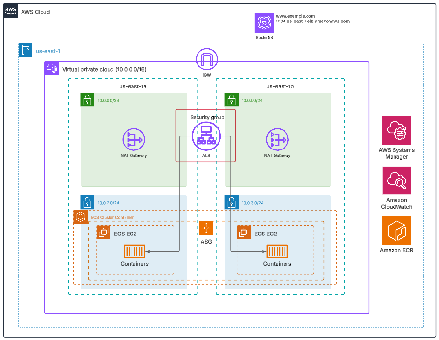
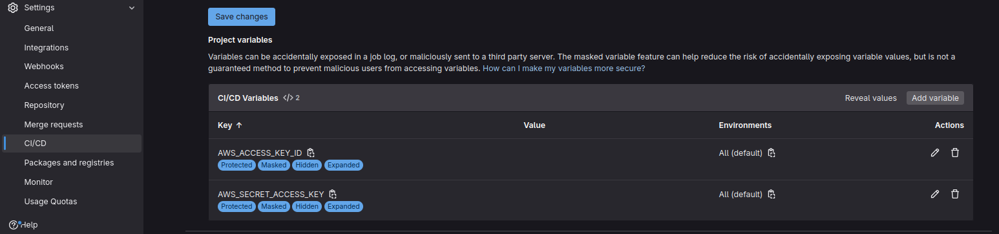

# Terraform ECS-EC2 basic infrastructure

This project uses **Terraform** to deploy infrastructure on **AWS** that includes:

- A **VPC** network with public and private subnets, internet gateway and nat gateways.
- An **Application Load Balancer (ALB)** to route traffic.
- **EC2** instances managed by an **Auto Scaling Group**.
- **ECS** tasks to run containers.
- A **DNS record** on **Route53** to call the alb using an alias.



> [!note]
> This project is designed as a customizable template. You can modify variables, remove optional modules, or reuse modules according to your needs.

## Requirements

1. **Terraform**: versión >= 1.0.0.
2. **AWS account**:
    - Permissions to create the resources (VPC, IGW, NGW, EIP, ECS, EC2, IAM y Route53).
    - A **domain registered on Route53** (Only if `route53` module is used).
3. **AWS CLI** with credentials configured.

## How to modify the settings?

- **Variables:** Modify variables in `terraform.tfvars` to customize the infrastructure (see example below).
- **Modules:** Modules in `terraform/modules` can be reused or removed according to your needs.
- **ALB Configuration:** You can adjust listeners, SSL policies, and routing rules in the `alb` module.
- **ECS Tasks:** Change ECS task settings, such as the container image, CPU, memory, and ports.

**`terraform.tfvars` example:**

```hcl
cidr_block         = "10.0.0.0/16"
public_subnets     = ["10.0.0.0/24", "10.0.1.0/24"]
private_subnets    = ["10.0.2.0/24", "10.0.3.0/24"]
enable_nat_gateway = true
certificate_arn    = "arn:aws:acm:region:account-id:certificate/certificate-id"
domain_name        = "example.com"
subdomain_name     = "app"

ec2_config = {
  image                  = "nginx:latest"
  container_port         = 80
  instance_type          = "t2.micro"
  volume_size            = 8
  volume_type            = "gp3"
  ssh_security_group_ids = []
  num_instances          = 2
  task_role_name         = null
}
```

### Main variables

| Variable              | Descripción                                                   | Valor por defecto                |
|-----------------------|---------------------------------------------------------------|----------------------------------|
| `local.name`          | Name prefix for all resources deployed with terraform.        | `"tf-test-webapp"`               |
| `local.region`        | AWS region.                                                   | `"us-east-1"`                    |
| `cidr_block`          | IP address range for the VPC.                                 | `"10.0.0.0/16"`                  |
| `public_subnets`      | Public subnets.                                               | `["10.0.0.0/24", "10.0.1.0/24"]` |
| `private_subnets`     | Private subents.                                              | `["10.0.2.0/24", "10.0.3.0/24"]` |
| `enable_nat_gateway`  | Enable NAT Gateways for private subnets.                      | `true`                           |
| `certificate_arn`     | SSL certificate ARN for the ALB.                              | `""`                             |
| `domain_name`         | Domain name registered on Route53.                            | `"example.com"`                  |
| `subdomain_name`      | Subdomain for DNS record.                                     | `"www"`                          |
| `ec2_config`          | Configuring EC2 instances and ECS tasks (see example above).  | `{}`                             |

## How to run it?

### Local execution

```shell
# 1. Clone the repository
git clone https://github.com/Joel252/terraform-ecs-ci.git
cd terraform-ecs-ci/terraform

# 2. Initialize Terraform
terraform init

# 3. Preview changes
terraform plan -out=tfplan

# 4. Apply changes
terraform apply tfplan

# 5. Destroy infrastructure (Only if necessary)
terraform destroy
```

> [!note]
> **Make sure to modify the `backend.tf` file** to use local storage (`local`) instead of remote storage (`http`) if you don't need it; otherwise, add your storage configuration. If you're using local storage, the `terraform.tfstate` file is located in the project directory.

### Automated execution with GitLab CI/CD

The project has a pipeline to facilitate infrastructure deployment.

1. **Upload the project to GitLab:** Create a new repository in GitLab and upload the project files.
2. **Setup CI/CD variables:** Go to `Settings > CI/CD > Variables` and add the following variables:
    - `AWS_ACCESS_KEY_ID`
    - `AWS_SECRET_ACCESS_KEY`

    
3. **Run the pipeline:** Commit to the `main` or `dev` branch to have GitLab automatically run the pipeline.
4. **Verify deployment:**

    - Review the pipeline logs to confirm that the infrastructure was created correctly.
    - Access the deployed service through the domain configured in Route 53.

#### Pipeline flow

1. **`update_docs`:** Updates the Terraform documentation if it detects changes in the files
2. **`terraform_init`:** Initializes Terraform.
3. **`terraform_validate`:** Validates Terraform configuration files.
4. **`terraform_plan`:** Generates an execution plan to make changes to the infrastructure.
5. **`terraform_apply`:** Apply changes to your infrastructure using Terraform.
6. **`terraform_destroy`:** Removes infrastructure resources when necessary.
